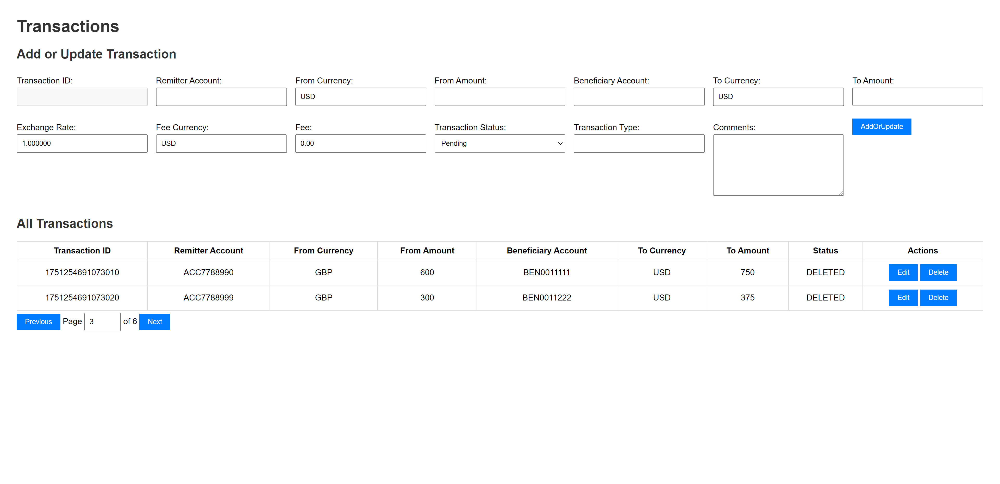

# Project

transaction-manage-service is a demo project for transaction management within a banking system. This demo application
enables users to record, view, and manage financial transactions.

* Framework: Spring Framework 6 + Spring Boot 3
* Servlet: Spring MVC 6 (Tomcat 10.1.x)
* Accessing the Database: Mybatis
* Database: H2
* API Documentation: spring-doc
* Frontend Template Engine: Thymeleaf

# How to Start

```
mvn package
docker build --no-cache -t transaction-manage-service .
docker run -p 8080:8080 transaction-manage-service
```

[Index Page](http://localhost:8080/index.html?page=3&size=2)



[Swagger API](http://localhost:8080/swagger-ui/index.html#/transactions/search)

# Dependencies

| Dependency                                                  | Function                                                    |
|-------------------------------------------------------------|-------------------------------------------------------------|
| org.springframework.boot:spring-boot-starter-web            | the java(jakarta) EE servlet functionalities                |
| org.springframework.boot:spring-boot-starter-thymeleaf      | the frontend/web pages engine                               |
| org.mybatis.spring.boot:mybatis-spring-boot-starter         | use mybatis to access database                              |
| com.h2database:h2                                           | use H2 as the database                                      |
| org.springdoc:springdoc-openapi-starter-webmvc-ui           | use springdoc to generate swagger API documentations        |
| org.projectlombok:lombok                                    | use lombok to simplify development                          |
| org.springframework.boot:spring-boot-starter-test           | for testing                                                 |
| org.springframework.boot:spring-boot-starter-aop            | to enable AspectJ implementation to enhance request logging |
| org.springframework.boot:spring-boot-starter-validation     | to enable Hibernate validations                             |
| com.fasterxml.jackson.datatype:jackson-datatype-jsr310      | enable jackson to support JSR-310 types                     |
| org.mapstruct:mapstruct & org.mapstruct:mapstruct-processor | simplify the conversion between view objects and entities   |

# APIs

For detailed API request/response layouts, please start up the application and then check
the [swagger documentation site](http://localhost:8080/swagger-ui/index.html#/).

| Method | URI                                 | Description                                             |
|--------|-------------------------------------|---------------------------------------------------------|
| GET    | /api/v1/transaction/{transactionId} | Get a transaction by ID                                 |
| PUT    | /api/v1/transaction/{transactionId} | Update an exisitng transaction by ID                    |
| DELETE | /api/v1/transaction/{transactionId} | Delete a transaction by ID                              |
| GET    | /api/v1/transaction                 | Searches transactions based on criteria with pagination |
| POST   | /api/v1/transaction                 | Creates a new transaction with the provided details     |
